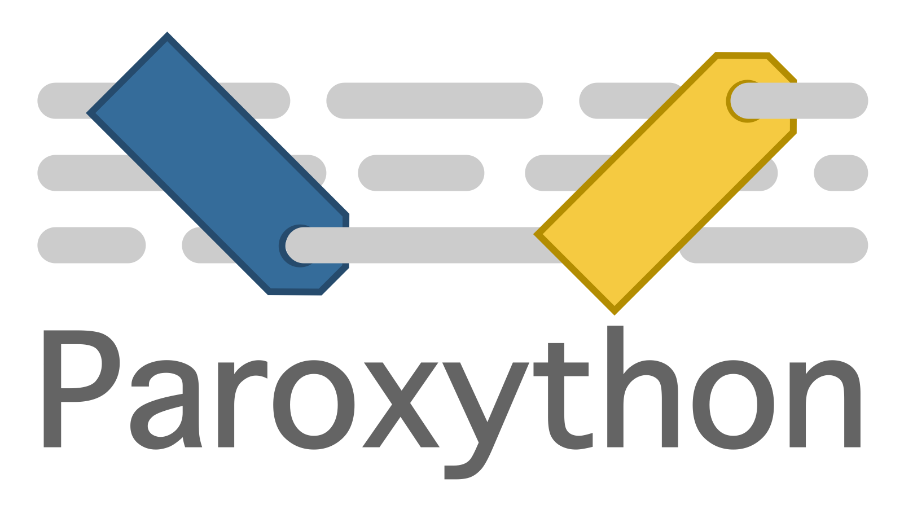

[](https://github.com/laowantong/paroxython/actions/workflows/build.yml)
[](https://codecov.io/gh/laowantong/paroxython)
[](http://mypy-lang.org/)
[](https://www.codacy.com/manual/laowantong/paroxython)
[](https://pyup.io/repos/github/laowantong/paroxython/)

[]()

[](https://github.com/laowantong/paroxython/blob/master/paroxython)
[](https://github.com/laowantong/paroxython/blob/master/tests)
[](https://github.com/laowantong/paroxython/blob/master/helpers)
[](https://github.com/laowantong/paroxython/blob/master/paroxython/resources/spec.md)
[](https://github.com/laowantong/paroxython/blob/master/paroxython/resources/taxonomy.tsv)

[](https://pepy.tech/project/paroxython/week)
[](https://github.com/psf/black)
[](https://opensource.org/licenses/MIT)
[](https://youtu.be/QcbR1J_4ICg?t=54)

<p align="center">
  <a href="https://laowantong.github.io/paroxython/index.html">
  
  </a>
</p>

## Introduction

Paroxython is a set of command line tools which **tag** and **filter** by algorithmic features your collection of Python programming exercises.

### Audience

You are a teacher, in charge of an introductory programming course in an educational institution. Over the years, you have accumulated many—far too many—programs and code snippets that may be of interest to your students.

Or, as a seasoned developer, you would like to share your knowledge by helping a loved one learn how to code. A cursory search for pedagogical material yields an overwhelming amount of websites and repositories stuffed with Python programs of various levels (e.g.,
[1](https://github.com/TheAlgorithms/Python),
[2](http://rosettacode.org/wiki/Category:Python),
[3](https://www.programming-idioms.org/about#about-block-language-coverage),
[4](https://github.com/codebasics/py),
[5](https://github.com/keon/algorithms),
[6](https://github.com/OmkarPathak/Python-Programs),
and a lot more from [Awesome Python in Education](https://github.com/quobit/awesome-python-in-education)).

In any case, the Python source codes you have gathered are typically
**numerous** (hundreds or even thousands),
**reasonably sized** (anything below 100 lines of code),
and **educational** in nature (e.g., snippets, examples, quizzes, exercise solutions, classic algorithms).
The programming concepts you plan to teach remain relatively **low level** (e.g. assignments, nested loops, accumulation patterns, tail recursive functions, etc.).

If all that sounds familiar, keep reading me.

### Main goals

Paroxython aims to help you select, from your collection, the one program that best suits your needs. For instance, it will gladly answer the following questions:

> - How can this concept be illustrated?
> - What problems use the same algorithmic and data structures as this one?
> - What homework assignment should I give my students so they can practice the content of the last lesson?

Moreover, since Paroxython knows what your class knows, it can recommend the right program at the right time:

> - What would make a good review exercise?
> - Which exercises can I give on this exam?
> - What is the current learning cost of this example?

In the long run, Paroxython may guide you and somehow make you rethink your course outline:

> - What are the prerequisites for the concept of assignment?
> - Do I have enough material to introduce subroutines before I even talk about conditionals and loops?
> - Among the loops, which must come first: the most powerful (`while`), or the most useful (`for`)?
> - How to logically structure this bunch of usual iterative patterns?
> - What are the _basics_, exactly?

All issues on which the author changed his mind since he started to work on this project!

In an ideal world, Paroxython could even put an end to the deadliest religious wars, with rational, data-driven arguments:

> - Father, is it a sin to exit early?
> - Should a real byte use a mask?

### How it works

<p align="center">
  <a href="https://laowantong.github.io/paroxython/developer_manual/index.html">
  
  </a>
</p>

Paroxython starts from a given folder of **programs**. Its contents is parsed, and all features that meet the provided **specifications** are labelled and associated with their spans (e.g., `"assignment_lhs_identifier:a": 4, 6, 18` or `"loop_with_late_exit:while": 3-7, 20-29`).

These **labels** constitute only scattered knowledge. The next step is to map them onto a **taxonomy** designed with basic hierarchical constraints in mind (e.g., the fact that the introduction of the concept of early exit must come after that of loop, which itself requires that of control flow, is expressed by the _taxon_ `"flow/loop/exit/early"`).

<p align="center">
  <a href="https://laowantong.github.io/paroxython/user_manual/index.html#taxonomy">
  
  </a>
  <br>
  <em>Extract of the taxonomy generated from <a href="https://github.com/TheAlgorithms/Python">The Algorithms - Python</a>.<br>Click to jump to its full dynamic version in the user manual.</em>
</p>

Everything is then persisted in a tag **database**, which can later be filtered through a **pipeline** of commands, for instance:

- _include_ only the programs which feature a recursive function;
- _exclude_ this or that program you want to set aside for the exam;
- “_impart_” all programs studied so far, _i.e_, consider that all the notions they implement are acquired.

The result is a list of program **recommendations** ordered by increasing learning cost.

### Example

Suppose that the `programs` directory contains [these simple programs](https://wiki.python.org/moin/SimplePrograms).

First, build [this tag database](https://github.com/laowantong/paroxython/blob/master/examples/simple/programs_db.json):

```shell
> paroxython collect programs
Labelling 21 programs.
Mapping taxonomy on 21 programs.
Writing programs_db.json.
```

Then, filter it through [this pipeline](https://github.com/laowantong/paroxython/blob/master/examples/simple/programs_pipe.py):

```shell
> paroxython recommend programs
Processing 5 commands on 21 programs.
  19 programs remaining after operation 1 (impart).
  18 programs remaining after operation 2 (exclude).
  12 programs remaining after operation 3 (exclude).
  10 programs remaining after operation 4 (include).
  10 programs remaining after operation 5 (hide).
Dumped: programs_recommendations.md.
```

Et voilà, [your recommendation report](https://github.com/laowantong/paroxython/blob/master/examples/simple/programs_recommendations.md)!


## Installation and test-drive

### Command line

Much to no one's surprise:

```
python -m pip install paroxython
```

The following command should print a help message and exit:

```
paroxython --help
```

### IPython magic command

If you use Jupyter notebook/lab, you've also just installed a so-called magic command. Load it like this:

```python
%load_ext paroxython
```

This should print `"paroxython 0.7.0 loaded."`. Run it on a cell of Python code:

```python
%%paroxython                          # Lines
def fibonacci(n):                     # 2
    result = []                       # 3
    (a, b) = (0, 1)                   # 4
    while a < n:                      # 5
        result.append(a)              # 6
        (a, b) = (b, a + b)           # 7
    return result                     # 8
```

| Taxon | Lines |
|:--|:--|
| `call/subroutine/method/sequence/list/append` | 6 |
| `condition/inequality` | 5 |
| `def/subroutine/function/impure` | 2-8 |
| `def/subroutine/parameter/arg` | 2 |
| `flow/loop/exit/late` | 5-7 |
| `flow/loop/while` | 5-7 |
| `meta/count/program/sloc/8` | 2-8 |
| `meta/count/subroutine/sloc/7` | 2-8 |
| `meta/count/variety/3` | 2-8 |
| `meta/program` | 2-8 |
| `operator/arithmetic/addition` | 7 |
| `style/procedural` | 2-8 |
| `type/number/integer/literal` | 4 |
| `type/number/integer/literal/zero` | 4 |
| `type/sequence/list` | 6 |
| `type/sequence/list/literal/empty` | 3 |
| `type/sequence/tuple/literal` | 4, 4, 7, 7 |
| `var/assignment/explicit/parallel` | 4 |
| `var/assignment/explicit/parallel/slide` | 7 |
| `var/assignment/explicit/single` | 3 |
| `var/assignment/implicit/parameter` | 2 |
| `var/scope/local` | 2-8, 2-8, 2-8, 2-8 |

As you can see, in this program, Paroxython identifies among others:

- the use of the [procedural paradigm](https://en.wikipedia.org/wiki/Procedural_programming) (`style/procedural`);
- an im[pure function](https://en.wikipedia.org/wiki/Pure_function) (`def/subroutine/function/impure`);
- a `while` loop (`flow/loop/while`) with a late exit (`flow/loop/exit/late`);
- a little bit of voodoo on lists (`type/sequence/list/literal/empty` and `call/subroutine/method/sequence/list/append`);
- a simple [tuple assignment](https://en.wikibooks.org/wiki/Python_Programming/Tuples#Packing_and_Unpacking) (`var/assignment/explicit/parallel`). Note that we distinguish between explicit (with `=`) and implicit (parameters and iteration variables) assignments;
- a “sliding” tuple assignment (`var/assignment/explicit/parallel/slide`). If the denomination is unique to us, the pattern itself occurs in a number of programs: implementations of [C-finite sequences](https://en.wikipedia.org/wiki/Constant-recursive_sequence) with C greater than 1, [Greatest Common Divisor](https://en.wikipedia.org/wiki/Greatest_common_divisor), [Quicksort](https://en.wikipedia.org/wiki/Quicksort), etc.
- four local variables (`var/scope/local`);
- an estimation of the variety of concepts involved (`meta/count/variety/***`), depending on the number of lines, features and distinct features.

The magic command `%%paroxython` (corresponding to the subcommand [`tag`](https://laowantong.github.io/paroxython/cli_tag.html)) only scratches the surface of the system. As shown before, to estimate the learning cost of the features and get actionable recommendations, you will need first to construct the tag database with [`collect`](https://laowantong.github.io/paroxython/cli_collect.html), and then call [`recommend`](https://laowantong.github.io/paroxython/cli_recommend.html) on a pipeline of yours.

# Read them

Although this is still a work-in-progress, Paroxython should already be fairly well [documented](https://laowantong.github.io/paroxython/index.html):

- [User manual](https://laowantong.github.io/paroxython/user_manual/index.html):
  - [write a command pipeline to get recommendations](https://laowantong.github.io/paroxython/user_manual/index.html#pipeline-tutorial),
  - [prepare your program collections for better results](https://laowantong.github.io/paroxython/user_manual/index#preparing-your-program-collection),
  - [understand and modify the taxonomic classification](https://laowantong.github.io/paroxython/user_manual/index#taxonomy),
  - and more.
- [Developer manual](https://laowantong.github.io/paroxython/developer_manual/index.html):
  - [get a rough idea of the program structure and operations](https://laowantong.github.io/paroxython/developer_manual/index.html#bird-view),
  - [use the provided helpers to contribute to the code](helper-programs),
  - and more.
- [Module reference](https://laowantong.github.io/paroxython/#header-submodules).
- [Feature specifications](https://github.com/laowantong/paroxython/blob/master/paroxython/resources/spec.md): a document mixing prose, tests, regular expressions and SQL queries to describe which algorithmic features are recognized and how.
- [User types](https://github.com/laowantong/paroxython/blob/master/paroxython/user_types.py): all objects of interest are precisely typed and checked by [mypy](http://mypy-lang.org).

Finally, a [battery of examples](https://github.com/laowantong/paroxython/tree/master/examples) and [comprehensive test coverage](https://github.com/laowantong/paroxython/tree/master/tests) should help answer any remaining question.
